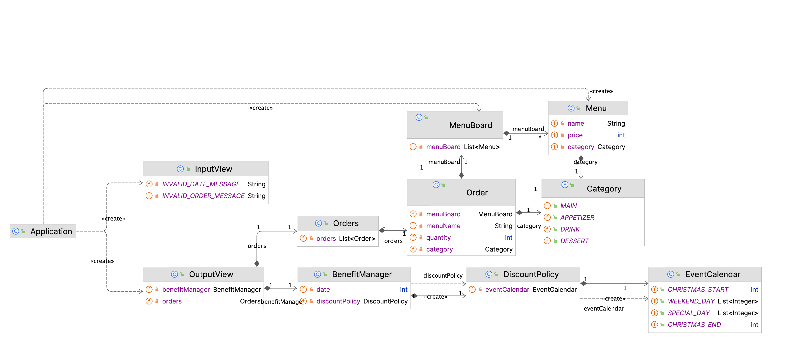

# 미션 - 크리스마스 프로모션🎅

--- 

## ✏️ 요구사항

사용자로부터 주문을 받고, 주문 내역과 방문 일자에 부합하는 할인 및 이벤트 내역을 출력하는 **크리스마스 프로모션을 구현**한다.

프로그램은 다음과 같은 방식으로 동작한다.


### 프로그램 실행 예시

```
안녕하세요! 우테코 식당 12월 이벤트 플래너입니다.
12월 중 식당 예상 방문 날짜는 언제인가요? (숫자만 입력해 주세요!)
3
주문하실 메뉴를 메뉴와 개수를 알려 주세요. (e.g. 해산물파스타-2,레드와인-1,초코케이크-1)
티본스테이크-1,바비큐립-1,초코케이크-2,제로콜라-1
12월 3일에 우테코 식당에서 받을 이벤트 혜택 미리 보기!
 
<주문 메뉴>
티본스테이크 1개
바비큐립 1개
초코케이크 2개
제로콜라 1개
 
<할인 전 총주문 금액>
142,000원
 
<증정 메뉴>
샴페인 1개
 
<혜택 내역>
크리스마스 디데이 할인: -1,200원
평일 할인: -4,046원
특별 할인: -1,000원
증정 이벤트: -25,000원
 
<총혜택 금액>
-31,246원
 
<할인 후 예상 결제 금액>
135,754원
 
<12월 이벤트 배지>
산타
```

### 이벤트

**총주문 금액이 10,000원 이상**인 경우에, 다음의 달력을 참고해 이벤트가 적용된다.


| 이벤트          | 기간                     | 내용                                             | 비고                                           |
|:-------------|:-----------------------|:-----------------------------------------------|:---------------------------------------------|
| 크리스마스 디데이 할인 | 2023.12.1 ~ 2023.12.25 | 1,000원으로 시작하여 크리스마스가 다가올수록 날마다 할인 금액이 100원씩 증가 | 총주문 금액에서 해당 금액만큼 할인                          ||
| 평일 할인        | 2023.12.1 ~ 2023.12.31 | 평일에는 디저트 메뉴를 메뉴 1개당 2,023원 할인                  | 평일: 일요일~목요일                                  |
| 주말 할인        | 2023.12.1 ~ 2023.12.31 | 주말에는 메인 메뉴를 메뉴 1개당 2,023원 할인                   | 주말: 금요일, 토요일                                 |
| 특별 할인        | 2023.12.1 ~ 2023.12.31 | 이벤트 달력에 별이 있으면 총주문 금액에서 1,000원 할인              | 총 6일(3, 10, 17, 24, 25, 31)                  |
| 증정 이벤트       | 2023.12.1 ~ 2023.12.31 | 할인 전 총주문 금액이 12만 원 이상일 때, 샴페인 1개 증정            | 단순 증정(주문 후 주문 금액에서 제하는 등 별도의 할인이 아님)         |
| 이벤트 배지 부여    | 2023.12.1 ~ 2023.12.31 | 총혜택 금액에 따라 다른 이벤트 배지를 부여                       | 5천 원 이상: 별 <br/>1만 원 이상: 트리<br/> 2만 원 이상: 산타 |


---

## 🤗 ️프로젝트 구조

### 프로그램 디렉토리 구조

```css
main
│
└── java
└── christmas
├── benefit
│ ├── BenefitManager.java
│ ├── Discount.java
│ ├── DiscountPolicy.java
│ ├── EventBadge.java
│ └── EventCalendar.java
├── menu
│ ├── Category.java
│ ├── Menu.java
│ └── MenuBoard.java
├── order
│ └── Order.java
│ └── Orders.java
├── ui
│ ├── InputView.java
│ └── OutputView.java
└── Application.java
test
│
└── java
└── christmas
├── discount
│ └── DiscountPolicyTest.java
├── event
│ ├── EventCalendarTest.java
│ └── EventManagerTest.java
├── menu
│ └── MenuBoardTest.java
├── order
│ └── OrderTest.java
└── ApplicationTest.java

```

- benefit - 할인, 이벤트와 관련된 모든 혜택 관리
- menu - 메뉴, 메뉴판(메뉴 목록) 등 메뉴 전반 관리
- order - 모든 주문을 생성하고 관리
- ui - 입출력 관리

### 클래스 다이어그램



## 🚀 기능 목록

### 핵심 로직

| 역할         | 기능(책임)                                                                                                                                | 비고                                                                      |
|:-----------|:--------------------------------------------------------------------------------------------------------------------------------------|:------------------------------------------------------------------------|
| **메뉴**     | 분류, 이름, 가격을 가진다<br/>메뉴 이름이 맞는지 확인한다                                                                                                   | 음식은 **[에피타이저, 메인, 디저트, 음료]** 로 분류된다.<br/> -> 별도의 **Category enum**으로 분리 |
| **메뉴판**    | 메뉴 목록을 가진다 <br/> 메뉴 이름으로 메뉴 클래스 존재 여부를 확인한다.<br/>메뉴의 분류, 가격을 반환한다                                                                     | 요구사항으로 주어진 메뉴는 Application에서 입력한다.                                      |
| **주문**     | 메뉴판과 분류, 메뉴 이름, 주문수량을 가진다<br/>주문과 주문수량을 검증해 주문을 생성한다<br/>해당 주문에 대한 금액(가격 * 주문수량)을 반환한다<br/>해당 주문의 분류를 확인한다<br/>분류, 메뉴 이름, 주문 수량을 반환한다 | 메뉴판에 존재하는 메뉴만 주문이 가능하다<br/>주문은 1~20개만 가능하다                              |
| **주문 목록**  | 주문과 관련된 입력을 바탕으로 주문 목록을 생성한다<br/>주문 목록을 검증한다<br/>주문 개수를 반환한다<br/>메뉴 이름과 주문 수량 목록을 반환한다<br/>카테고리별 총 주문수량을 반환한다<br/>총금액을 반환한다           | 음료만 주문하는 것은 불가하다<br/>주문은 한번에 최대 20개까지만 가능하다                             |
| **이벤트 달력** | 크리스마스 기간, 특별 할인일, 주말 등 할인 기간에 대한 정보를 가진다<br/>주어진 날짜가 할인 기간에(크리스마스/특별할인/평일/주말) 해당하는 지 여부를 반환한다.                                        | 할인은 **[크리스마스, 특별, 평일, 주말, 증정]** 으로 분류된다                                 |
| **할인**     | 할인 자체에 대한 정보를 가진다<br/>할인 금액, 추가 할인금액(크리스마스의 경우), 할인을 위한 가격 조건을 필드로 가지며 이를 반환한다                                                        | enum 타입                                                                 |
| **할인 정책**  | 각 할인에 대한 할인 로직을 가진다<br/>주어진 날짜와 주문이 할인 조건에 부합하는지 여부를 확인하고 할인 금액을 반환한다                                                                 | 할인 로직은 [이벤트 설명](docs/README.md:51) 참조                                   |
| **이벤트 배지** | 이벤트 배지 자체와 해당 이벤트 배지의 획득 조건인 혜택 금액을 가진다. <br/> 이름과 혜택 금액을 반환한다                                                                        | 이벤트 배지는 **[없음, 별, 트리, 산타]** 로 분류된다.<br/> enum 타입                        |
| **혜택 관리**  | 할인 정책과 이벤트를 바탕으로 할인 혜택과 이벤트 배지를 반환한다<br/> 총 주문 금액에서 총 혜택 금액을 제한 최종 결제 금액을 반환한다                                                        |                                                                         |

### UI 로직

| 구분     | 책임                             | 비고                                                                                                                                                   | 에러 메시지/예시                                                                                    |
|:-------|:-------------------------------|:-----------------------------------------------------------------------------------------------------------------------------------------------------|:---------------------------------------------------------------------------------------------|
| **입력** | 방문 날짜를 입력받는다<br/>입력값을 검증한다     | 1~31 사이의 숫자만 입력 가능하다<br/> 유효하지 않은 입력시  에러 메시지를 출력한다                                                                                                  | "[ERROR] 유효하지 않은 날짜입니다. 다시 입력해 주세요."                                                                                             |
| **입력** | 주문 메뉴와 개수를 입력받는다<br/>입력값을 검증한다 | 에러 메시지를 출력하는 경우<br/>- 메뉴판에 없는 메뉴를 입력하는 경우<br/>- 주문 개수의 경우 1 이상의 숫자 이외의 입력값을 입력하는 경우<br/>- 메뉴 형식이 예시와 다른 경우<br/>- 중복 메뉴를 입력한 경우(e.g. 시저샐러드-1,시저샐러드-1) | "[ERROR] 유효하지 않은 주문입니다. 다시 입력해 주세요."                                                                                             |
| **출력** | 주문 메뉴를 출력한다                    | 출력 순서는 자유                                                                                                                                            | <주문 메뉴><br/>타파스 1개<br/>제로콜라 1개                                                               |
| **출력** | 할인 전 총주문 금액을 출력한다              |                                                                                                                                                      | <할인 전 총주문 금액> <br/>8,500원                                                                    |
| **출력** | 증정 메뉴를 출력한다                    | 증정 메뉴가 없다면 "없음"을 출력한다                                                                                                                                | <증정 메뉴> <br/>샴페인 1개                                                                          |
| **출력** | 적용된 혜택 내역을 출력한다                | 혜택 내역이 없다면 "없음"을 출력한다<br/> 여러 개의 이벤트가 적용된 경우, 출력 순서는 자유                                                                                              | <혜택 내역><br/>크리스마스 디데이 할인: -1,200원<br/>평일 할인: -4,046원<br/>특별 할인: -1,000원<br/>증정 이벤트: -25,000원 |
| **출력** | 12월 이벤트 배지 출력한다                | 혜택 내역이 없다면 "없음"을 출력한다                                                                                                                                | <12월 이벤트 배지><br/>산타                                                                          |

혜택 내역, 총혜택 금액, 할인 후 예상 결제 금액, 12월 이벤트 배지 내용

입력 부분에서 해당 조건에 부합하지 않는 잘못된 값을 입력한 경우, IllegalArgumentException이 발생한다.
에러 메시지와 함께 에러 발생 후, 해당 부분부터 다시 입력받는다.

---

## ✅ 테스트

주어진 요구사항에 따라 UI 로직을 제외한 핵심 로직에만 테스트를 구현했다.

### MenuBoard 
| 테스트 내용                     |  통과 여부 |
|:---------------------------|:--------------------------|
| 메뉴판에 존재하는 메뉴면 true/fase 반환 |  ✔️ |
| 메뉴판에 존재하는 메뉴면 카테고리 반환      |  ✔️ |
| 메뉴판에 존재하지 않는 메뉴면 예외 발생     |  ✔️ |

### Order

| 테스트 내용                          |  통과 여부 |
|:--------------------------------|:--------------------------|
| 메뉴에 없는 음식을 주문하면 예외 처리한다         |  ✔️ |
| 1개 미만으로 주문하면 예외 처리한다            |  ✔️ |
| 20개를 초과 주문하면 예외 처리한다            |  ✔️ |
| 주문한 메뉴의 가격과 주문한 수량으로 주문금액을 계산한다 |  ✔️ |

### Orders

| 테스트 내용                     | 통과 여부 |
|:---------------------------|:------|
| 총 주문가능 수량(20)을 초과하는 경우 예외 처리한다 | ✔️    | 
| 음료만 주문하는 경우 예외 처리한다 | ✔️      |
| 주문내역을 통해 총금액을 반환한다 |    ✔️   |
| 주문한 메뉴의 카테고리별 총 주문 금액을 반환한다 |    ✔️   |

### EventCalendar
| 테스트 내용                     | 통과 여부 |
|:---------------------------|:------|
| 1~25일은 크리스마스 할인 기간이다. | ✔️    |
| 25일 이후는 크리스마스 할인 기간이 아니다. | ✔️    |
| 3, 10, 17, 24, 25, 31일은 특별 할인 기간이다. | ✔️    |
| 3, 10, 17, 24, 25, 31일을 제외한 날은 특별 할인 기간이 아니다. | ✔️    |
| 1, 2, 8, 9, 15, 16, 22, 23, 29, 30일은 주말 할인 기간이다.(평일 할인 기간이 아니다) | ✔️    |
| 1, 2, 8, 9, 15, 16, 22, 23, 29, 30일은 주말 할인 기간이다.(평일 할인 기간이 아니다) | ✔️    |

### DiscountPolicy
| 비고       | 테스트 내용                     | 통과 여부 |
|:---------|:---------------------------|:------|
| 크리스마스 할인 | 크리스마스 기간에는 크리스마스 할인을 받을 수 있다 | ✔️    |
|          | 만원 미만으로 주문하면 크리스마스 할인을 받을 수 없다 | ✔️    |
|          | 크리스마스가 지나면 크리스마스 할인을 받을 수 없다 | ✔️    |
| 특별 할인    |특정 날짜에는 특별 할인을 받을 수 있다 |      ✔️  |
|          |만원 미만으로 주문하면 특별 할인을 받을 수 없다 |  ✔️      |
|          | 특정 날짜가 아니면 특별 할인을 받을 수 없다 |       ✔️ |
| 평일 할인    | 평일에 디저트를 주문하면 평일 할인을 받을 수 있다 |     ✔️   |
|          | 만원 미만으로 주문하면 평일 할인을 받을 수 없다 |      ✔️  |
| 주말 할인    | 주말에 메인을 주문하면 주말 할인을 받을 수 있다 |      ✔️  |
|          | 주말에 메인을 주문하면 주말 할인을 받을 수 있다 |     ✔️   |
| 증정       | 12만원 이상 구매시 증정 할인을 받을 수 있다 |       ✔️ |
|          | 12만원 미만 구매시 증정 할인을 받을 수 없다 |      ✔️  |


### BenefitManager

| 테스트 내용                     | 통과 여부 |
|:---------------------------|:------|
| 총혜택금액이 5천원 미만이면 배지 '없음'이다 | ✔️    |
| 총혜택금액이 5천원 이상 1만원 미만이면 배지 '별'이다 | ✔️    |
| 총혜택금액이 1만원 이상 2만원 미만이면 배지 '트리'이다 | ✔️    |
| 총혜택금액이 2만원 이상이면 배지 '산타'이다 | ✔️    |
| 주문내역과 주문일자를 입력하면 총혜택금액을 반환한다 | ✔️    |
| 주문내역과 주문일자를 입력하면 총결제금액을 반환한다 | ✔️    |

---

## 🤔 고려 사항

### 객체지향적 설계

책임 분산과 로직 분리

재사용성

자료구조


### 생성자와 정적 팩터리 메서드


### 전략 패턴


---

감사합니다 🙇‍