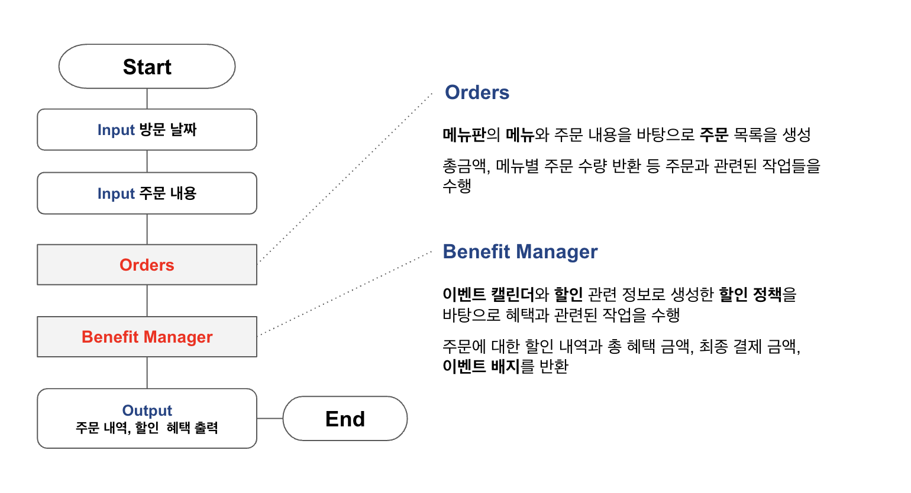

# 미션 - 크리스마스 프로모션🎅

--- 
## ✏️ 요구사항 

크리스마스 프로모션을 구현한다. 프로그램은 다음과 같은 방식으로 동작한다.

### 이벤트 내용

총주문 금액 10,000원 이상부터 달력을 참고해 다음의 이벤트가 적용된다.

| 이벤트             | 기간                      | 내용                                             | 비고                  |
|:----------------|:------------------------|:-----------------------------------------------|:--------------------|
| 크리스마스 디데이 할인    | 2023.12.1 ~ 2023.12.25  | 1,000원으로 시작하여 크리스마스가 다가올수록 날마다 할인 금액이 100원씩 증가 | 총주문 금액에서 해당 금액만큼 할인 ||
| 평일 할인(일요일~목요일)  | 2023.12.1 ~ 2023.12.31  | 평일에는 디저트 메뉴를 메뉴 1개당 2,023원 할인                  |                     |
| 주말 할인(금요일, 토요일) | 2023.12.1 ~ 2023.12.31  | 주말에는 메인 메뉴를 메뉴 1개당 2,023원 할인                   |                     |
| 특별 할인           | 2023.12.1 ~ 2023.12.31  | 이벤트 달력에 별이 있으면 총주문 금액에서 1,000원 할인              |                     |
| 증정 이벤트          | 2023.12.1 ~ 2023.12.31  | 할인 전 총주문 금액이 12만 원 이상일 때, 샴페인 1개 증정            |                     |
| 이벤트 배지 부여       | 2023.12.1 ~ 2023.12.31  | 총혜택 금액에 따라 다른 이벤트 배지를 부여                       | 5천 원 이상: 별  1만 원 이상: 트리  2만 원 이상: 산타                                   |

---

## 🚀 기능 목록

### 핵심 로직

| 역할       | 기능(책임)                                                                                      | 비고                                          |
|:---------|:--------------------------------------------------------------------------------------------|:--------------------------------------------|
| 음식       | 분류, 이름, 가격을 가진다                                                                             |                                             |
| 주문       | 음식 리스트를 가진다 주문 개수를 반환한다 총금액을 반환한다 주문 내에 특정 음식이 있는지 확인한다                     | 음료만 주문하는 것은 불가하다 주문은 한번에 최대 20개까지만 가능하다 |
| 이벤트 달력   | 음식 리스트를 가진다 총금액을 반환한다 주문 내에 특정 음식이 있는지 확인한다                                         |                                             |
| 할인 정책    | 다음의 네 가지 할인 정책을 가진다 - 크리스마스 디데이 할인 - 평일 할인 - 주말 할인 - 특별 할인  할인 금액을 반환한다 |                                             |
| 이벤트      | 증정 여부와 내용을 반환한다 이벤트 배지를 반환한다                                                            |                                             |
| 이벤트 컨트롤러 | 할인 정책과 이벤트를 바탕으로 주문에 대한 증정 여부와 내용, 이벤트 배지를 반환한다                                             |                                             |

### UI 로직

| 구분 | 책임                             | 비고                                                                                                                                                                                                                                                                                                                                    | 예시                                                                                                                        |
|:---|:-------------------------------|:--------------------------------------------------------------------------------------------------------------------------------------------------------------------------------------------------------------------------------------------------------------------------------------------------------------------------------------|:--------------------------------------------------------------------------------------------------------------------------|
| 입력 | 방문 날짜를 입력받는다 입력값을 검증한다     | 1~31 사이의 숫자만 입력 가능하다  유효하지 않은 입력시 "[ERROR] 유효하지 않은 날짜입니다. 다시 입력해 주세요." 에러 메시지를 출력한다                                                                                                                                                                                                                                               |                                                                                                                           |
| 입력 | 주문 메뉴와 개수를 입력받는다 입력값을 검증한다 | 메뉴판에 없는 메뉴를 입력하는 경우, "[ERROR] 유효하지 않은 주문입니다. 다시 입력해 주세요."라는 에러 메시지를 출력한다 주문 개수의 경우 1 이상의 숫자 이외의 입력값은 "[ERROR] 유효하지 않은 주문입니다. 다시 입력해 주세요."라는 에러 메시지를 출력한다  메뉴 형식이 예시와 다른 경우, "[ERROR] 유효하지 않은 주문입니다. 다시 입력해 주세요."라는 에러 메시지를 출력한다  중복 메뉴를 입력한 경우(e.g. 시저샐러드-1,시저샐러드-1), "[ERROR] 유효하지 않은 주문입니다. 다시 입력해 주세요."라는 에러 메시지를 출력한다 |                                                                                                                           |
| 출력 | 주문 메뉴를 출력한다                    | 출력 순서는 자유                                                                                                                                                                                                                                                                                                                             | <주문 메뉴> 타파스 1개 제로콜라 1개                                                                                            |
| 출력 | 할인 전 총주문 금액을 출력한다              |                                                                                                                                                                                                                                                                                                                                       | <할인 전 총주문 금액>  8,500원                                                                                                 |
| 출력 | 증정 메뉴를 출력한다                    | 증정 메뉴가 없다면 "없음"을 출력한다                                                                                                                                                                                                                                                                                                                 | <증정 메뉴>  샴페인 1개                                                                                                       |
| 출력 | 적용된 혜택 내역을 출력한다                | 혜택 내역이 없다면 "없음"을 출력한다  여러 개의 이벤트가 적용된 경우, 출력 순서는 자유                                                                                                                                                                                                                                                                               | <혜택 내역> 크리스마스 디데이 할인: -1,200원 평일 할인: -4,046원 특별 할인: -1,000원 증정 이벤트: -25,000원                              |
| 출력 | 12월 이벤트 배지 출력한다                | 혜택 내역이 없다면 "없음"을 출력한다       | <12월 이벤트 배지> 산타           |

혜택 내역, 총혜택 금액, 할인 후 예상 결제 금액, 12월 이벤트 배지 내용

입력 부분에서 해당 조건에 부합하지 않는 잘못된 값을 입력한 경우, IllegalArgumentException이 발생한다.
에러 메시지와 함께 에러 발생 후, 해당 부분부터 다시 입력받는다.

---

## ✅ 테스트 

---

## 🤔 고려 사항
